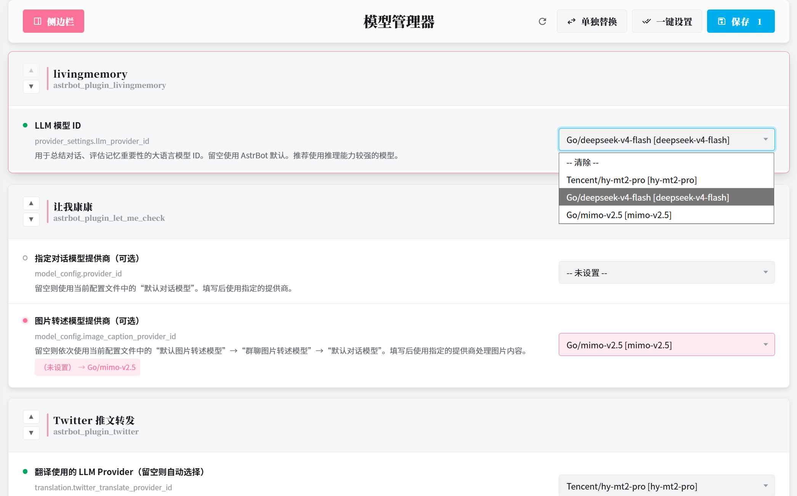
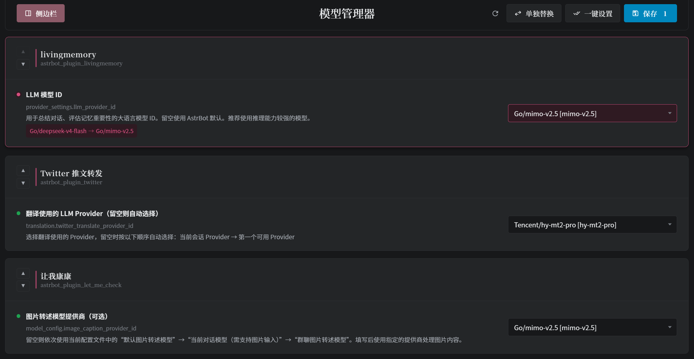

<h1 align="center">模型管理器</h1>

<p align="center">
  
</p>

<p align="center">
  
  
  
</p>

<p align="center">统一管理所有插件的 LLM 模型配置，支持单独替换、一键设置、插件排序、侧边栏导航、中英文切换。</p>

<p align="center">
  
</p>

## 功能简介

模型管理器把所有插件的 LLM 模型配置集中到一个页面里，不用挨个插件去翻设置。想给某个插件换模型，或者把所有插件一次性统一到同一个模型，打开 Model Manager 页面几步就能完成。还支持调整插件显示顺序、隐藏不常用的插件，模型失效时会醒目提醒。页面自动跟随 AstrBot 的语言设置，中英文随意切换。

## 内容列表

- [功能简介](#功能简介)
- [功能特性](#功能特性)
- [界面预览](#界面预览)
- [安装](#安装)
- [环境要求](#环境要求)
- [配置说明](#配置说明)
- [使用示例](#使用示例)
- [维护者](#维护者)
- [如何贡献](#如何贡献)
- [许可证](#许可证)

## 功能特性

- **统一管理**：集中查看和修改所有插件的 LLM 模型配置，不用挨个插件去翻设置
- **单独替换**：一键把旧模型替换为新模型，所有正在使用旧模型的配置项同时更新
- **批量统一**：批量把多个插件一次性切换到同一个模型
- **WebUI 管理页面**：在 AstrBot WebUI 中打开可视化管理页面，下拉选择即可完成修改
- **自动排序**：自定义插件的显示顺序，排序结果自动保存
- **折叠隐藏**：隐藏不常用的插件，让页面更清爽
- **悬空模型提示**：配置的模型已不存在时给出醒目提示，避免悄悄失效

## 界面预览

| 浅色模式 | 深色模式 |
|---|---|
|  |  |

## 安装

### 方法一：通过插件市场安装（推荐）

1. 打开 AstrBot WebUI → 插件管理 → 插件市场。
2. 添加插件源（如尚未添加）：
   - 源名称：`AstrBot Official Plugin Market`
   - 源地址：`https://cloud-test.astrbot.app/api/v1/market/plugins.json`
3. 在插件市场中搜索 **模型管理器**（`astrbot_plugin_model_manager`），点击安装。
4. 等待安装完成，确认插件已启用。

### 方法二：从 GitHub 安装

1. 打开 AstrBot WebUI → 插件管理 → 新增插件。
2. 选择 **从 GitHub 安装**。
3. 填入仓库地址：
   ```
   https://github.com/NoFizz/astrbot_plugin_model_manager
   ```
4. 等待安装完成，确认插件已启用。

### 方法三：手动安装

1. 将本仓库克隆或下载到 AstrBot 的插件目录：
   ```bash
   cd AstrBot/data/plugins
   git clone https://github.com/NoFizz/astrbot_plugin_model_manager.git
   ```
2. 在 AstrBot WebUI 中重载插件，或重启 AstrBot。

### 安装后检查

- 在 WebUI 插件管理中确认插件状态为"已启用"且无报错。
- 进入插件详情页，确认 Model Manager 页面可正常打开。

## 环境要求

- Python >= 3.10
- pyyaml

## 配置说明

本插件无需额外配置，安装即用。所有操作通过 WebUI Page 完成。

**工作原理**：插件会自动扫描所有已安装插件的 `_conf_schema.json`，找出带有 `_special: select_provider*` 标记的配置项（即模型选择器），将它们集中展示在 Model Manager 页面中。修改后直接写入对应插件的配置文件，无需改动任何插件代码。

## 使用示例

1. 进入本插件的详情页，打开 **Model Manager** 页面
2. 页面会自动扫描并列出所有插件的模型配置项
3. 在每个下拉框中选择想分配的模型
4. 点击右上角 **保存**，一次性保存所有修改

### 单独替换

点击 **单独替换**：先选「当前模型」，再选「新模型」，即可把所有使用当前模型的配置项一次性替换为新模型。适合整体迁移到某个新模型的场景。

### 一键设置

点击 **一键设置**：选择一个目标模型，即可把所有配置项统一设为该模型。

### 插件排序

点击插件卡片左侧的 **▲ / ▼** 按钮调整显示顺序，排序会自动保存。侧边栏中的拖拽排序与隐藏操作同样会被持久化。

### 强制刷新

点击页面右上角的 **刷新** 按钮，会绕过扫描缓存立即重新扫描所有插件的模型配置，适合在安装/卸载其他插件后手动刷新。

### 悬空模型提示

当某个配置项当前保存的模型在可用模型列表中不存在时（例如该模型已被删除），该配置项会以警告样式高亮并显示提示图标，提醒重新选择。

### 语言

界面语言跟随 AstrBot WebUI 的全局语言设置。在 WebUI **设置** 中切换语言后，本页面会自动切换，无需刷新。

## 维护者

**NoFizz** · [GitHub](https://github.com/NoFizz)

## 如何贡献

欢迎提交 [Issue](https://github.com/NoFizz/astrbot_plugin_model_manager/issues) 反馈问题或功能建议，也接受 [Pull Request](https://github.com/NoFizz/astrbot_plugin_model_manager/pulls)。

## 许可证

本项目基于 [AGPL-3.0](LICENSE) 许可证开源。
